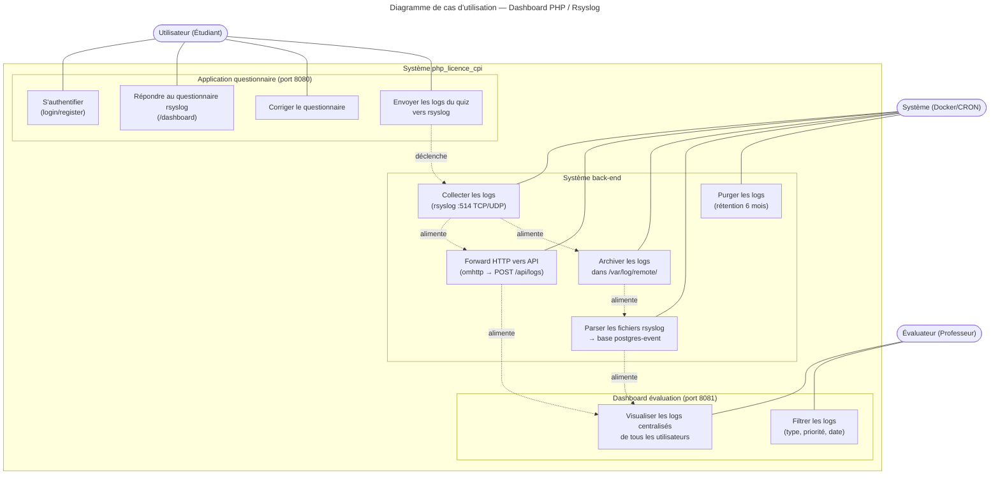
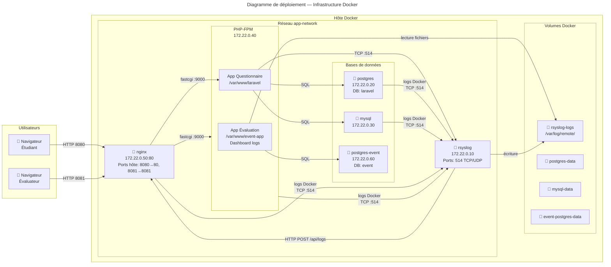
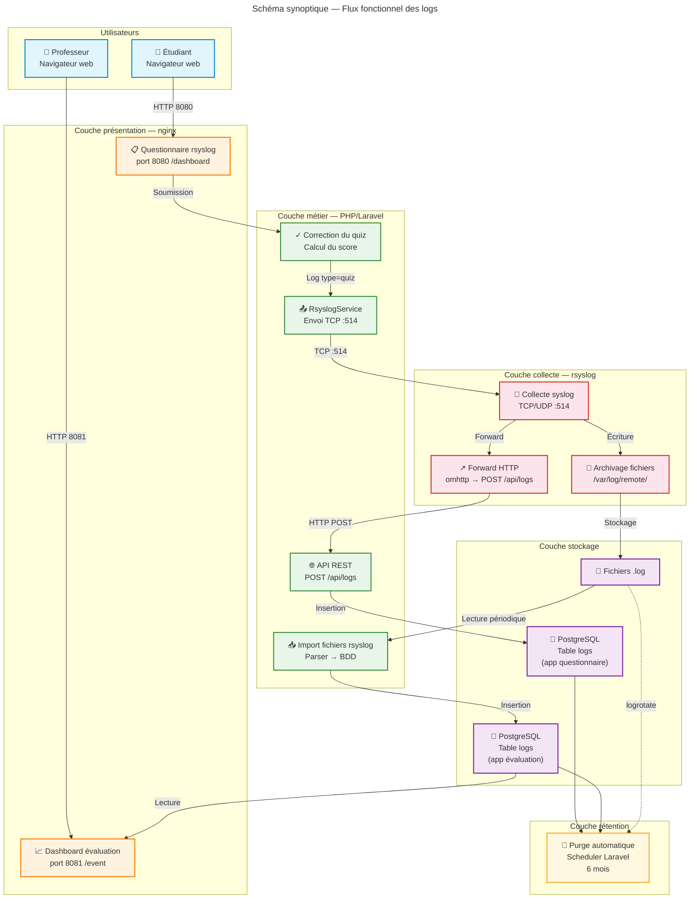
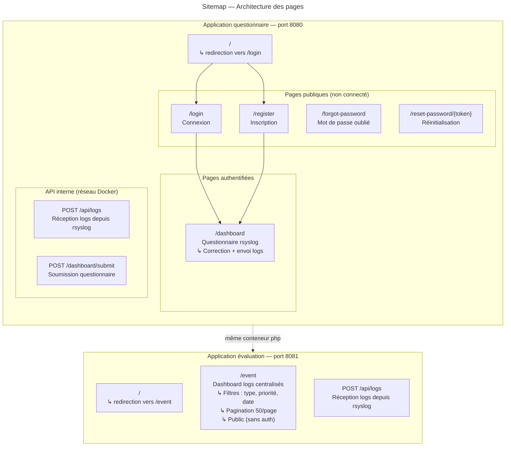
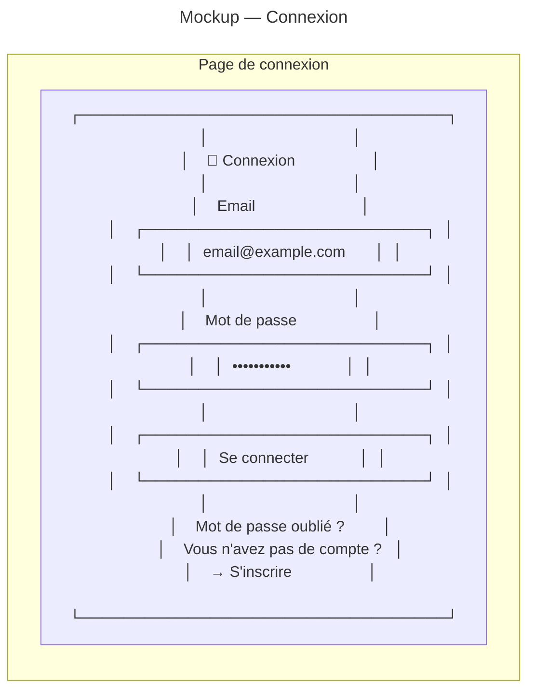
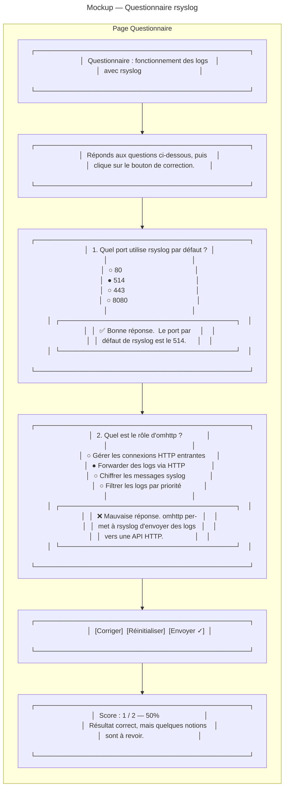

# Analyse UML — Projet php_licence_cpi

## Diagramme de cas d'utilisation (Use Case)

---

## Diagramme de déploiement / blocs

---

## Schéma synoptique

---

## Légende des flux

| Flux | Protocole | Direction |
|------|-----------|-----------|
| Navigation questionnaire | HTTP 8080 | Étudiant → nginx |
| Navigation évaluation | HTTP 8081 | Évaluateur → nginx |
| Exécution PHP | FastCGI :9000 | nginx → php-fpm |
| Logs applicatifs | Syslog TCP :514 | PHP → rsyslog |
| Logs conteneurs | Docker syslog driver → TCP :514 | Tous conteneurs → rsyslog |
| Forward HTTP | HTTP POST /api/logs | rsyslog → nginx → Laravel |
| Import fichiers | Lecture volume Docker | event-app → /var/log/remote/ |
| Requêtes SQL | PostgreSQL / MySQL | Laravel/event-app → BDD |

---

## Sitemap (Plan du site)

---

## Mockups (Maquettes fonctionnelles)

### Mockup 1 — Page de connexion (/login)

### Mockup 2 — Questionnaire (/dashboard)

### Mockup 3 — Dashboard évaluation (port 8081 /event)

```mermaid
---
title: Mockup — Dashboard évaluation (port 8081)
---
flowchart TB
    subgraph Page["Page Dashboard Évaluation"]
        direction TB

        Title["
        ┌─────────────────────────────────────────────┐
        │  Événements & Logs — Évaluation            │
        └─────────────────────────────────────────────┘
        "]

        Filters["
        ┌─────────────────────────────────────────────┐
        │  Type    Priorité    Du          Au         │
        │  ┌────┐  ┌───────┐  ┌────────┐ ┌────────┐  │
        │  │Tous│  │Toutes │  │jj/mm  │ │jj/mm  │  │
        │  └────┘  └───────┘  └────────┘ └────────┘  │
        │  [Filtrer]  [Réinitialiser]                │
        └─────────────────────────────────────────────┘
        "]

        Log1["
        ┌─────────────────────────────────────────────┐
        │  [warning]  [auth]  [quiz]  #42  système    │
        │  Score 2/5 - Quel port utilise rsyslog...   │
        │  ▸ Voir le détail des réponses (2/5)        │
        │                              10/06/2026     │
        └─────────────────────────────────────────────┘
        "]

        Log2["
        ┌─────────────────────────────────────────────┐
        │  [info]  [local0]  [system]  système         │
        │  Log système depuis le conteneur nginx      │
        │                              10/06/2026     │
        └─────────────────────────────────────────────┘
        "]

        Log3["
        ┌─────────────────────────────────────────────┐
        │  [error]  [kern]  [system]  système         │
        │  Kernel error from container php            │
        │                              10/06/2026     │
        └─────────────────────────────────────────────┘
        "]

        Pagination["
        ┌─────────────────────────────────────────────┐
        │  ← Précédente   1 2 3 ... 8   Suivante →   │
        └─────────────────────────────────────────────┘
        "]

        Note["
        ℹ️ Page publique — aucune authentification requise
        "]

        Title --> Filters --> Log1 --> Log2 --> Log3 --> Pagination
        Filters --> Note
    end
```

