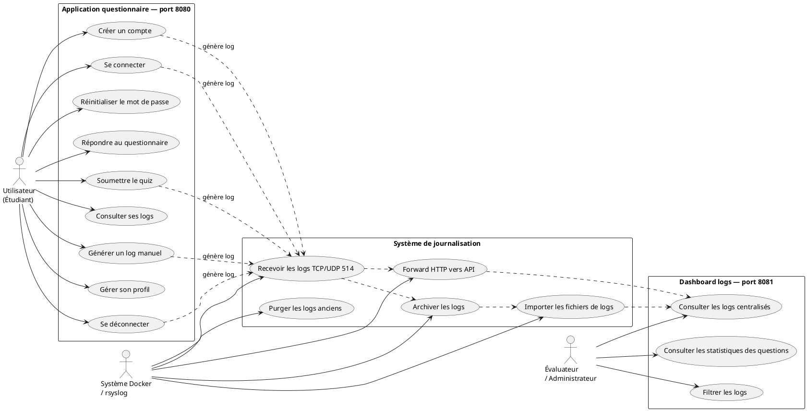
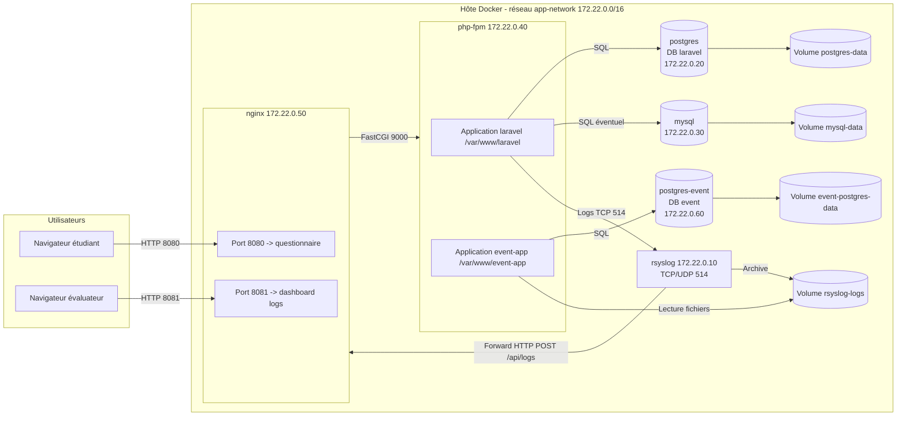
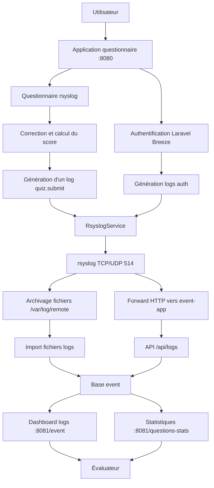

# Analyse UML — Projet php_licence_cpi

## Objectif

Ce document présente les éléments de conception du projet : cas d'utilisation, déploiement Docker, schéma synoptique, sitemap complet et maquettes fonctionnelles. Il est construit pour correspondre aux routes et fonctionnalités réellement présentes dans les deux applications Laravel.

---

## Diagramme de cas d'utilisation



---

## Diagramme de déploiement / blocs



---

## Schéma synoptique du projet



---

## Légende des flux

| Flux | Protocole | Direction |
|---|---|---|
| Navigation questionnaire | HTTP 8080 | Utilisateur → nginx |
| Navigation dashboard | HTTP 8081 | Évaluateur → nginx |
| Exécution PHP | FastCGI 9000 | nginx → php-fpm |
| Logs applicatifs | Syslog TCP 514 | Laravel → rsyslog |
| Logs conteneurs | Docker syslog driver | Conteneurs → rsyslog |
| Forward HTTP | HTTP POST `/api/logs` | rsyslog → event-app |
| Import fichiers | Lecture volume Docker | event-app → `/var/log/remote` |
| Requêtes SQL | PostgreSQL / MySQL | Applications → bases |

---

## Sitemap complet

```mermaid
flowchart TB
    subgraph Questionnaire[Application questionnaire - port 8080]
        ROOT1[/]
        LOGIN[/login]
        REGISTER[/register]
        FORGOT[/forgot-password]
        RESET[/reset-password/{token}]
        VERIFY[/verify-email]
        DASH[/dashboard]
        SUBMIT[POST /dashboard/submit]
        EVENT[/event]
        GENERATOR_GET[GET /generator]
        GENERATOR_POST[POST /generator]
        PROFILE_GET[GET /profile]
        PROFILE_PATCH[PATCH /profile]
        PROFILE_DELETE[DELETE /profile]
        LOGOUT[POST /logout]
        API_LOGS1[POST /api/logs]
    end

    subgraph EventApp[Application dashboard logs - port 8081]
        ROOT2[/]
        EVENT2[/event]
        STATS[/questions-stats]
        API_LOGS2[POST /api/logs]
    end

    ROOT1 --> LOGIN
    LOGIN --> DASH
    REGISTER --> DASH
    FORGOT --> RESET
    DASH --> SUBMIT
    DASH --> EVENT
    DASH --> GENERATOR_GET
    GENERATOR_GET --> GENERATOR_POST
    DASH --> PROFILE_GET
    PROFILE_GET --> PROFILE_PATCH
    PROFILE_GET --> PROFILE_DELETE
    DASH --> LOGOUT

    ROOT2 --> EVENT2
    EVENT2 --> STATS
```

---

## Maquettes fonctionnelles

### Maquette 1 — Connexion `/login`

```text
┌────────────────────────────────────────────┐
│ Connexion                                  │
├────────────────────────────────────────────┤
│ Email                                      │
│ [ utilisateur@example.com              ]   │
│ Mot de passe                               │
│ [ •••••••••••••••••                   ]   │
│                                            │
│ [ Se connecter ]                           │
│                                            │
│ Mot de passe oublié ?                      │
│ Pas encore de compte ? S'inscrire          │
└────────────────────────────────────────────┘
```

### Maquette 2 — Inscription `/register`

```text
┌────────────────────────────────────────────┐
│ Création de compte                         │
├────────────────────────────────────────────┤
│ Nom                                        │
│ [ Esteban                              ]   │
│ Email                                      │
│ [ esteban@example.com                  ]   │
│ Mot de passe                               │
│ [ •••••••••••••••••                   ]   │
│ Confirmation                              │
│ [ •••••••••••••••••                   ]   │
│                                            │
│ [ Créer le compte ]                        │
└────────────────────────────────────────────┘
```

### Maquette 3 — Questionnaire `/dashboard`

```text
┌────────────────────────────────────────────┐
│ Questionnaire rsyslog                      │
├────────────────────────────────────────────┤
│ Question 1 / 20                            │
│ Quel port utilise rsyslog par défaut ?     │
│ ( ) 80                                     │
│ (x) 514                                    │
│ ( ) 443                                    │
│                                            │
│ Question 2 / 20                            │
│ ...                                        │
│                                            │
│ [ Corriger ] [ Réinitialiser ] [ Envoyer ] │
└────────────────────────────────────────────┘
```

### Maquette 4 — Résultat du quiz

```text
┌────────────────────────────────────────────┐
│ Résultat du questionnaire                  │
├────────────────────────────────────────────┤
│ Score : 16 / 20                            │
│ Pourcentage : 80 %                         │
│                                            │
│ Réponses correctes : affichées en vert     │
│ Réponses incorrectes : affichées en rouge  │
│                                            │
│ Log généré : quiz.submit                   │
└────────────────────────────────────────────┘
```

### Maquette 5 — Générateur de logs `/generator`

```text
┌────────────────────────────────────────────┐
│ Générateur manuel de logs                  │
├────────────────────────────────────────────┤
│ Type d'événement                           │
│ [ auth.login ▼ ]                           │
│ Niveau                                     │
│ [ info ▼ ]                                 │
│ Message                                    │
│ [ Message de test                      ]   │
│                                            │
│ [ Générer le log ]                         │
└────────────────────────────────────────────┘
```

### Maquette 6 — Profil `/profile`

```text
┌────────────────────────────────────────────┐
│ Gestion du profil                          │
├────────────────────────────────────────────┤
│ Nom                                        │
│ [ Esteban                              ]   │
│ Email                                      │
│ [ esteban@example.com                  ]   │
│                                            │
│ [ Enregistrer ]                            │
│ [ Supprimer le compte ]                    │
└────────────────────────────────────────────┘
```

### Maquette 7 — Dashboard logs `/event`

```text
┌──────────────────────────────────────────────────────────────┐
│ Événements et logs                                           │
├──────────────────────────────────────────────────────────────┤
│ Type [Tous ▼] Priorité [Toutes ▼] Du [jj/mm] Au [jj/mm]      │
│ [ Filtrer ] [ Réinitialiser ]                                │
├──────────────────────────────────────────────────────────────┤
│ Date                Niveau    Type           Message         │
│ 10/06/2026 14:32    info      auth.login     Connexion OK    │
│ 10/06/2026 14:35    info      quiz.submit    Score 16/20     │
│ 10/06/2026 14:40    warning   auth.failed    Login refusé    │
├──────────────────────────────────────────────────────────────┤
│ ← Précédent   Page 1 / 8   Suivant →                         │
└──────────────────────────────────────────────────────────────┘
```

### Maquette 8 — Statistiques questions `/questions-stats`

```text
┌────────────────────────────────────────────┐
│ Statistiques des questions                 │
├────────────────────────────────────────────┤
│ Question | Réussite | Échecs | Taux        │
│ Q1       | 18       | 2      | 90 %        │
│ Q2       | 14       | 6      | 70 %        │
│ Q3       | 10       | 10     | 50 %        │
└────────────────────────────────────────────┘
```

---

## Cohérence routes / documentation

| Route | Application | Présente dans le sitemap | Fonction |
|---|---|---|---|
| `/login` | questionnaire | Oui | Connexion |
| `/register` | questionnaire | Oui | Inscription |
| `/dashboard` | questionnaire | Oui | Questionnaire |
| `POST /dashboard/submit` | questionnaire | Oui | Soumission quiz |
| `/event` | questionnaire | Oui | Logs personnels ou sensibles |
| `/generator` | questionnaire | Oui | Générateur de logs |
| `/profile` | questionnaire | Oui | Gestion profil |
| `/event` | event-app | Oui | Dashboard centralisé |
| `/questions-stats` | event-app | Oui | Statistiques questions |
| `POST /api/logs` | event-app | Oui | Réception logs |

## Conclusion

Cette analyse couvre les principales fonctionnalités et les routes des deux applications.
Les éléments de conception sont alignés avec l'infrastructure Docker, les usages attendus et les besoins de traçabilité du projet.