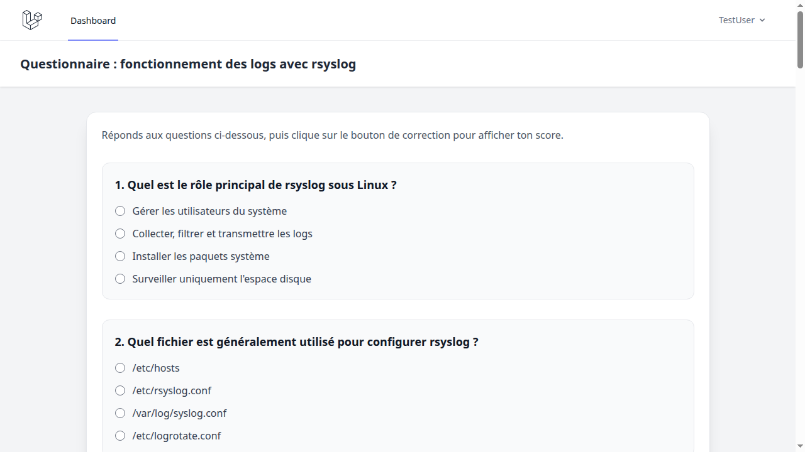
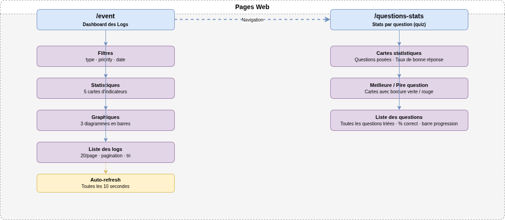
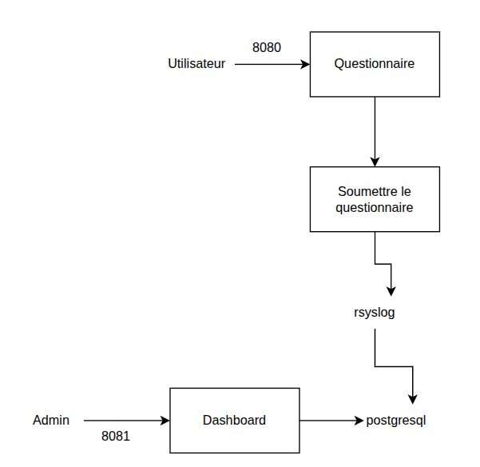
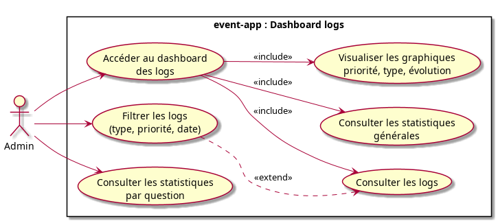

<!-- _class: lead -->

# Projet questionnaire rsyslog

## Site web de quiz avec journalisation centralisée

**Groupe G3**  
BORIE Léo · JACQUET Edouard · TEIXEIRA Esteban

---

# Sommaire

1. Contexte et analyse de l’existant
2. Expression du besoin
3. Informations attendues dans les logs
4. Objectifs du projet
5. Fonctions principales
6. Critères de performances
7. Contraintes techniques
8. Enoncé des tâches / répartition par étudiant
9. Matériels et Logiciels mis en œuvre
10. Sitemap — plan de site
11. Schéma synoptique
12. Diagramme de cas d'utilisation
13. Mockup — dashboard logs
14. Conclusion
15. Questions

---

# Contexte — analyse de l’existant

L’application permet déjà à un utilisateur de :

Créer un compte | Se connecter | Accéder à un questionnaire | Répondre aux questions | Soumettre le quiz



---

# Expression du besoin

Le besoin principal est d’ajouter un système de journalisation fiable.

Les événements à enregistrer sont :

- création de compte
- connexion réussie
- tentative de connexion échouée
- déconnexion
- accès au questionnaire
- rendu du quiz
- erreurs applicatives importantes

---

# Informations attendues dans les logs

Chaque log doit contenir les informations utiles à l’analyse :

| Élément | Exemple |
|---|---|
| Date / heure | `2026-06-11 14:32:10` |
| Niveau | `info`, `warning`, `error` |
| Action | `login`, `logout`, `quiz_submitted` |
| Utilisateur | ID utilisateur |
| Message | Description claire de l’événement |

---

# Objectifs du projet

- Tracer les actions utilisateur
- Centraliser les logs
- Consulter les événements
- Améliorer la sécurité
- Faciliter la maintenance
- Valider le fonctionnement

---

# Fonctions principales

Application de Dashboard - Port 8081

- Affichage de logs en temps réel, possibilité de tri
- Filtre de catégorie avec options de tri
- Message de logs clair
- Code couleur selon type d'erreur
- Vue des informations des logs

---

# Critères de performances

Les performances sont évaluées sur les actions critiques.

| Objectif | Critères de performances |
|---|---|
| Tracer les actions utilisateur | Un log est créé pour chaque action importante |
| Centraliser les logs | Les logs sont envoyés vers rsyslog |
| Consulter les événements | Un dashboard permet de lire les logs |
| Améliorer la sécurité | Les erreurs et connexions sont visibles |
| Faciliter la maintenance | Les logs permettent de comprendre les incidents |
| Valider le fonctionnement | Des tests prouvent chaque cas d’usage |

---

# Contraintes techniques

| Élément | Contrainte |
|---|---|
| Langage | PHP |
| Conteneurisation | Docker Compose |
| Journalisation | rsyslog |
| Base de données | PostgreSQL |

---

# Enoncé des tâches à réaliser par livrable / répartition par étudiant

<style scoped>
table { font-size: 14px; }
table td, table th { padding: 4px 10px; }
</style>

| Livrable | Tâche | Étudiant |
|---|---|---|
| Application event-app | Développer l'interface de consultation des logs avec filtres et code couleur | JACQUET Edouard, TEIXEIRA Esteban |
| Configuration Docker | Créer les fichiers Dockerfile et docker-compose pour l'infrastructure | BORIE Léo |
| Configuration rsyslog | Configurer rsyslog pour centraliser les logs de l'application | BORIE Léo |
| Documentation installation | Rédiger le guide d'installation et de démarrage du projet | TEIXEIRA Esteban |
| Documentation utilisateur | Rédiger le guide expliquant le parcours utilisateur complet | TEIXEIRA Esteban |
| Tests de validation | Tester chaque cas d'usage pour valider le bon fonctionnement | BORIE Léo |
| Mesures de performance | Mesurer et documenter les temps de réponse des actions critiques | BORIE Léo |
| Test de qualité | Analyser le code avec PHPStan pour garantir sa qualité | JACQUET Edouard |
| Diagrammes UML / sitemap / mockups | Concevoir les diagrammes de conception, le sitemap et les mockups | BORIE Léo |

---

# Matériels et Logiciels mis en œuvre

| Matériel / Logiciel | Utilisation |
|---|---|
| PC de développement | Développement et tests locaux |
| Navigateur web | Tests utilisateur et mesures Network |
| Terminal | Lancement Docker, Tests curl, PHPStan |
| PHP / Laravel | Développement web |
| Docker / Docker Compose | Infrastructure conteneurisée |
| rsyslog | Centralisation des logs |
| PostgreSQL | Stockage applicatif |
| Git / GitHub | Versionnement |
| PHPStan | Analyse statique |
| Vite | Assets front-end |

---

# Sitemap — plan de site



---

# Schéma synoptique



---

# Diagramme de cas d'utilisation



---

# Mockup — dashboard logs

```text
+----------------------------------------------------------------+
|                        Dashboard logs                          |
+----------------------------------------------------------------+
| Filtres : [niveau] [utilisateur] [date]                        |
+----------------------------------------------------------------+
| Date                | Niveau  | Utilisateur | Événement        |
| 2026-06-11 10:12    | info    | user@test.fr| Connexion        |
| 2026-06-11 10:18    | info    | user@test.fr| Quiz rendu       |
| 2026-06-11 10:20    | warning | inconnu     | Connexion échouée|
+----------------------------------------------------------------+
```

---

# Conclusion

Le projet répond à un besoin de traçabilité autour d’un site de questionnaire.

Les apports principaux sont :

- journalisation des actions importantes ;
- centralisation avec rsyslog ;
- consultation des logs ;
- documentation technique et utilisateur ;
- tests, indicateurs et critères de performance ;
- meilleure sécurité et meilleure maintenabilité.

---

<!-- _class: lead -->

# Questions ?